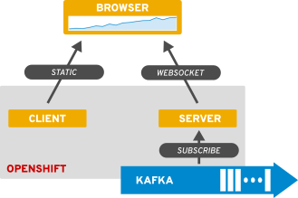

# kafka-openshift-react-sparkline

This application is for displaying formated data from an Apache Kafka topic
through a reactive browser-side client. It uses a simple chart visualization
to display the data.

## Architecture

## Prerequisites

* An OpenShift project available.

* An Apache Kafka broker.

* A source of messages for the Apache Kafka broker. See
  [/test/emitter/README.md](test/emitter/README.md) for an example.

## Quickstart

1. Deploy the server. See [/server/README.md](server/README.md)

1. Expose the server. `oc expose svc server`

1. Deploy the client, making note of the server's route. See [/client/README.md](client/README.md)

1. Visit the client's route.
